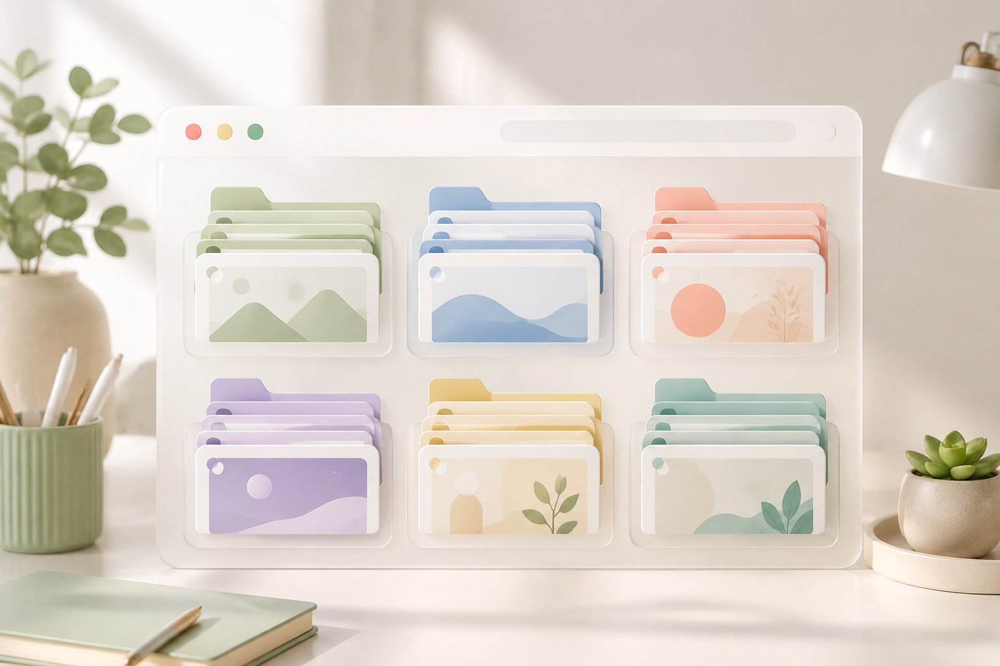
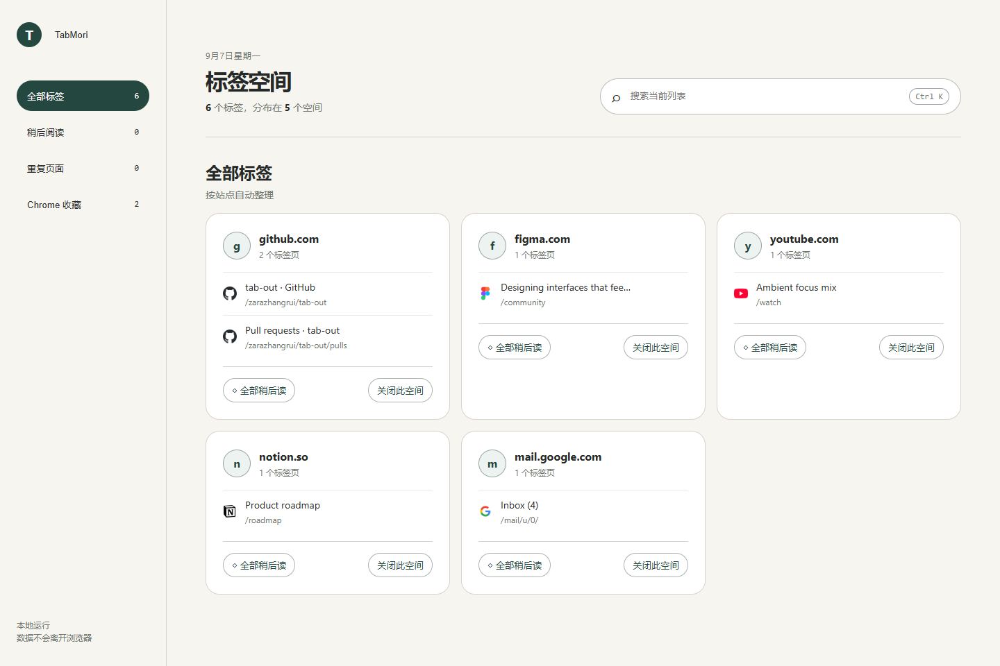

# TabMori



**浏览器开了 40 个标签页，真正要用时一个都找不到。**

TabMori 是一个干净、轻量的 Chrome 新标签页插件，用来整理一堆已经打开的标签页。它会按网站自动分组，支持搜索当前标签和 Chrome 收藏夹，帮你快速找到页面、关掉重复标签，把暂时不看的内容放到稍后阅读。



## 中文介绍

我做 TabMori 的原因很简单：Chrome 标签页开太多以后，找页面真的很烦。

很多标签管理插件功能很全，但界面复杂、按钮很多，看起来比标签页本身还累。TabMori 不想做成一个“大工作台”，它只保留最常用的几个动作：看清楚、搜得到、能跳回、能关掉。

### 功能

- 按网站自动分组当前标签页
- 搜索已经打开的标签页
- 搜索 Chrome 收藏夹
- 点击标签时跳回已打开页面，减少重复打开
- 标出重复页面
- 保存到稍后阅读
- 一键关闭整组标签
- 自定义页面名称，并保存在本地
- 纯本地运行，无账号、无服务端

### 从 ZIP 安装

1. 下载 `TabMori.zip`。
2. 先把 ZIP 解压成普通文件夹。
3. 打开 Chrome，进入 `chrome://extensions`。
4. 打开右上角的“开发者模式”。
5. 点击“加载已解压的扩展程序”。
6. 选择解压后的 TabMori 文件夹。
7. 新建一个标签页即可使用。

不要直接选择 ZIP 文件。Chrome 需要加载包含 `manifest.json` 的解压文件夹。

### 本地开发

TabMori 是一个普通的 Manifest V3 Chrome 扩展，不需要构建步骤。

```bash
git clone <repository-url>
cd TabMori
```

然后在 `chrome://extensions` 里打开开发者模式，加载这个项目文件夹。

### 隐私

TabMori 不使用服务端、账号系统、统计脚本或外部 API。

稍后阅读列表和自定义页面名称只会保存在浏览器本地的 `chrome.storage.local` 里。

## English

TabMori is a clean Chrome new tab extension for people who keep too many tabs open.

It groups opened tabs by website, helps you search tabs and bookmarks, highlights duplicates, and gives you a small read-later area without turning your new tab page into another heavy dashboard.

### Features

- Group current tabs by domain
- Search opened tabs
- Search Chrome bookmarks
- Jump to an existing tab instead of opening duplicates
- Highlight duplicate pages
- Save pages to read later
- Close a whole tab group quickly
- Rename the page title locally
- Works locally, without an account or server

### Install From ZIP

1. Download `TabMori.zip`.
2. Unzip it into a normal folder.
3. Open `chrome://extensions` in Chrome.
4. Turn on Developer mode.
5. Click Load unpacked.
6. Select the unzipped TabMori folder.
7. Open a new tab.

Do not select the ZIP file directly. Chrome needs the unzipped folder that contains `manifest.json`.

### Local Development

TabMori is a plain Manifest V3 extension. No build step is required.

```bash
git clone <repository-url>
cd TabMori
```

Then load the project folder from `chrome://extensions` with Developer mode enabled.

### Privacy

TabMori does not use a backend, account system, analytics, or external API.

Saved read-later items and the custom page name are stored locally with `chrome.storage.local`.

## License

MIT
